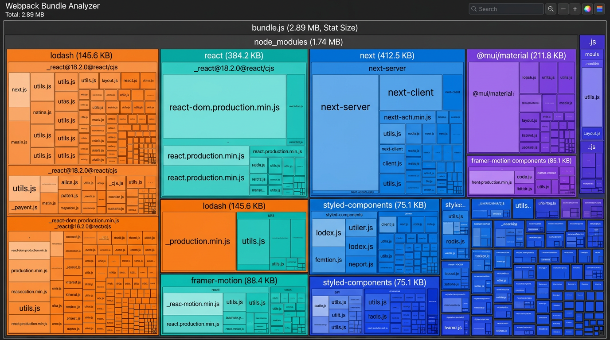
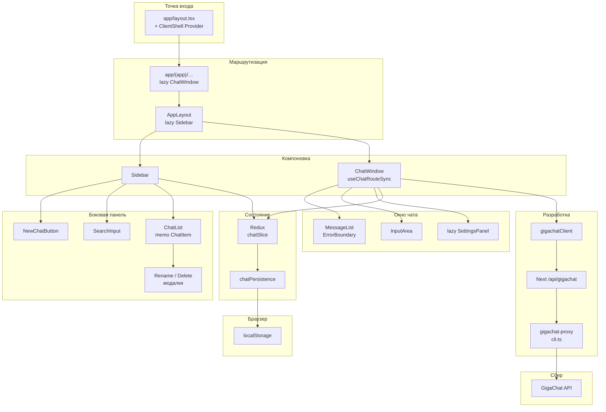

# Чат на Next.js + React + Redux + GigaChat

Учебный проект по дисциплине «Основы фронтенда»: несколько чатов, история сообщений, маршрутизация, локальное сохранение и ответы ассистента через **GigaChat API** (через dev-прокси).

## Функциональность

- **Чаты**: создание, переименование, удаление с подтверждением, автозаголовок по первому сообщению.
- **Поиск** по названию и тексту последнего сообщения.
- **Маршруты** `/` и `/chat/:id` (Next.js App Router); прямой заход по URL и refresh восстанавливают активный чат.
- **Redux Toolkit**: состояние чатов, стриминг и полные ответы ассистента, индикатор загрузки.
- **localStorage**: персистентность списка чатов и сообщений (с debounce при стриминге).
- **GigaChat**: OAuth и `chat/completions` на отдельном Node-сервисе `src/api/gigachat-proxy`; в браузер ключ не попадает. Поддержка SSE со fallback на обычный JSON.
- **Markdown** в ответах ассистента (`react-markdown`, `remark-gfm`) и подсветка кода (**Prism**), подгружаются отдельным чанком через `React.lazy` в `Message`.

## Скрипты

| Команда | Назначение |
|--------|------------|
| `npm run dev` | Next.js dev-сервер. |
| `npm run build` | Production-сборка Next.js. |
| `npm run analyze` | Сборка с **@next/bundle-analyzer** (treemap в браузере). |
| `npm run start` | Запуск production-сборки. |
| `npm run lint` | ESLint. |
| `npm run test` / `npm run test:run` | Vitest + Testing Library. |
| `npm run gigachat-proxy` | Поднять прокси на `127.0.0.1:8787` (или `GIGACHAT_PROXY_PORT`). |

## Аудит бандла

## Настройка прокси GigaChat

Скопируйте `.env.example` в `.env`, задайте `GIGACHAT_AUTHORIZATION_KEY`. При ошибках TLS к серверам Сбера — `GIGACHAT_INSECURE_SSL=true` (только для разработки).

## Диаграмма компонентов

## Технологический стек

React 19, TypeScript, Next.js 15, Redux Toolkit, react-redux, react-markdown, remark-gfm, Prism, undici (в прокси).
